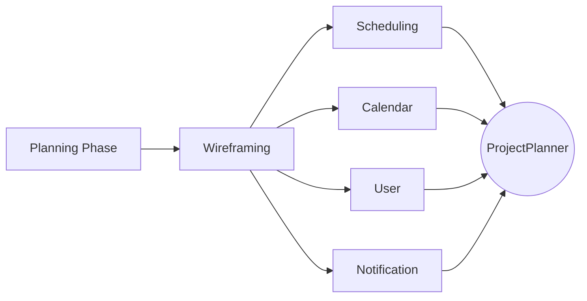

# Project-planner Backend

<p align="center">
  <a href="http://nestjs.com/" target="blank"></a>
</p>

[circleci-image]: https://img.shields.io/circleci/build/github/nestjs/nest/master?token=abc123def456
[circleci-url]: https://circleci.com/gh/nestjs/nest

  <p align="center">A progressive <a href="http://nodejs.org" target="_blank">Node.js</a> framework for building efficient and scalable server-side applications.</p>
    <p align="center">
  <!-- Badges -->
    <a href="https://www.npmjs.com/~nestjscore" target="_blank"></a>
    <a href="https://codecov.io/github/AcademyHeroes/projectplanner-backend" target="_blank" alt="codecov Review"> 
       
    </a>
  </p>

# Table of Contents

1. [Workflow](#current-progress-flow-⚠️wip)
2. [About the ProjectPlanner](#description)
3. [Installation Guide](#installation-steps)

## Current Progress Flow (⚠️WIP)

- Rectangle represents <b>Done</b>
- Rounded Rectangle represents <b>On-going</b>
- Circle represents <b>Scheduled</b>



## Description

[Nest](https://github.com/nestjs/nest) framework TypeScript starter repository.

## Pre-requisite

1. Ensure you have [Docker](https://www.docker.com/) installed, otherwise please visit this [website](https://www.docker.com/products/docker-desktop/) to download it.
2. You must have [Yarn](https://classic.yarnpkg.com/lang/en/docs/install/#windows-stable) installed

## Installation Steps

1. Install the dependency packages

```bash
$ yarn install
```

2. Build Docker images and you are ready to go

```bash
$ docker compose up --build -d
```

## Local Development

1. You need postgres container to be running (follow the above installation steps on how to launch the container)
2. Run the following command to start the NestJS application locally

```bash
$ yarn start:local
```

3. <b>ALTERNATIVELY</b>, if you have docker compose up and running, you can use it instead.

## OpenAPI View (Swagger)

1. Ensure you have the application up and running without any problems on port 3000
2. Go to http://localhost:3000/swagger

## Create & Migrate Database

```bash
$ yarn migrate:local
```

## Test

Utilizing Jest to do our end-to-end testing

```bash
# unit tests
$ npm run test

# e2e tests
$ npm run test:e2e

# test coverage
$ npm run test:cov
```

## Seeding of Database

Add in seed data to your Postgres Database

```bash
$ yarn seed
```

Trouble seeding? Try rebasing database

```bash
$ yarn migrate:local
```

## Prisma Studio

pgAdmin-like Database Dashboard view by running the command (hosted on localhost:5555):

```bash
$ yarn studio:local
```

## Stay in touch

- Author - 🤡
